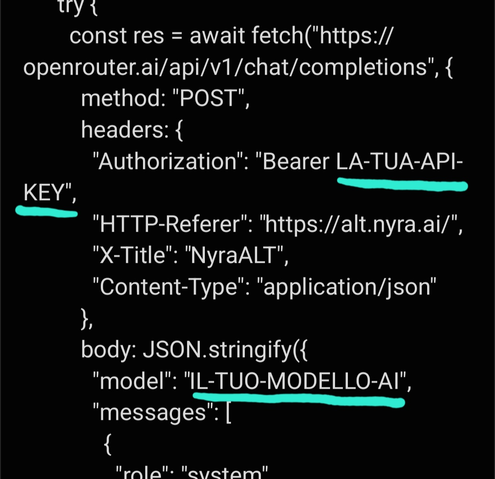

# Crea la tua AI basata su Nyra

Nyra è un'intelligenza artificiale basata su **Deepseek R1** che ti permette di accedere a informazioni dal web, fare conversazioni stimolanti e trovare motivazione per sviluppare nuove idee. Che tu voglia fare domande o semplicemente chiacchierare, Nyra è qui per te!

## Open Source

Nyra è un progetto **open-source**. Puoi liberamente esplorare, modificare e adattare il suo codice base alle tue esigenze. Per saperne di più su cosa significa open-source, visita [questa pagina su Wikipedia](https://it.m.wikipedia.org/wiki/Open_source).

## Crea la tua AI con Nyra

Se vuoi creare una versione personalizzata di Nyra, sei nel posto giusto! Il processo è semplice e gratuito. Ti basta avere una conoscenza di base dell'informatica e seguire questi passaggi.

### 1. Crea un progetto

Inizia creando un nuovo progetto in un IDE a tua scelta, come [Visual Studio Code](https://code.visualstudio.com/), o lavorando direttamente sul tuo PC.

### 2. Incolla il codice base

Scarica il codice base di Nyra dal link qui sotto e incollalo nel tuo progetto:

[Scarica il codice base di Nyra](https://github.com/madebyanto/nyra/releases/download/nyraaltopensource/nyra_alt_code.txt)

### 3. Modifica il codice

Per far funzionare correttamente la tua nuova AI, dovrai modificare alcune impostazioni di base, come ad esempio:

- Inserire la tua **API Key**
- Scegliere un **modello AI**

#### Come fare:

1. Vai su [OpenRouter](https://openrouter.ai) e crea un account.
2. Genera una [API Key](https://openrouter.ai/settings/keys).
3. Scegli un [modello gratuito](https://openrouter.ai/models?max_price=0).
4. Integra la tua **API Key** e il nome del **modello** nel codice.

**Modifiche da fare:**

---

**⚠️ IMPORTANTE:**  
Quando inserisci il nome del modello, assicurati di utilizzare il nome esatto che trovi nella "Overview" del modello su OpenRouter.  
**Esempio:**

### 4. Personalizza la tua AI

La parte funzionale della tua AI è pronta! Ora puoi aggiungere il tuo tocco personale. Personalizza Nyra con un logo, un nome, e modifica l'interfaccia utente usando **HTML**, **CSS** e **JavaScript**.

### 5. Buona fortuna!

Ora che hai la tua AI personalizzata, puoi usarla come vuoi. Fai in modo che Nyra rispecchi la tua visione, sia che si tratti di un assistente virtuale, di un bot motivazionale o di un sistema di risposte intelligenti!

---

## Note

Il team di **Aura Studio** non è responsabile per l'uso illecito o non autorizzato delle distribuzioni non ufficiali di Nyra. Nyra è un progetto open-source pensato per dare opportunità a chi vuole sviluppare un'AI potente e ambiziosa.

## Crediti e licenza

**Nyra** è stata sviluppata da [Anto](https://github.com/madebyanto) di **Aura Studio**.

---

**Nyra** è un progetto che appartiene a **Aura Studio**.

---

Le distribuzioni non ufficiali (ad esempio, quelle basate su Nyra) non sono affiliate con **Aura Studio**, e **Aura Studio** non è responsabile per queste versioni non ufficiali.
