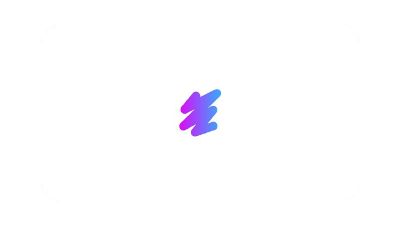
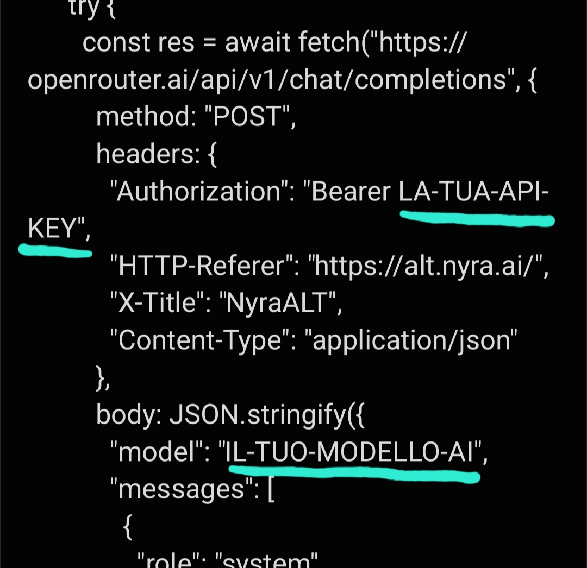
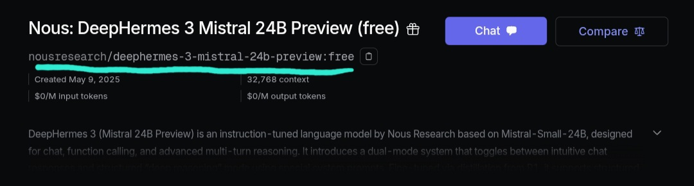

# Create Your Own AI Based on Nyra

Nyra is an artificial intelligence built on **Deepseek R1**, designed to help you access web information, have engaging conversations, and find motivation to develop new ideas. Whether you're looking for answers or just want to chat, Nyra is here for you!

## Open Source

Nyra is an **open-source** project. You are free to explore, modify, and adapt its base code to suit your needs. To learn more about what open source means, visit [this Wikipedia page](https://en.wikipedia.org/wiki/Open_source).

## Build Your AI with Nyra

If you want to create a personalized version of Nyra, you're in the right place! The process is simple and free. You just need basic IT knowledge and to follow these steps.

### 1. Create a Project

Start by creating a new project in your favorite IDE, such as [Visual Studio Code](https://code.visualstudio.com/), or work directly on your PC.

### 2. Paste the Base Code

Download Nyra’s base code from the link below and paste it into your project:

[Download Nyra’s base code](https://github.com/madebyanto/nyra/releases/download/nyraaltopensource/nyra_alt_code.txt)

### 3. Edit the Code

To make your new AI work properly, you'll need to modify some basic settings, such as:

- Inserting your **API Key**
- Choosing an **AI model**

#### How to do it:

1. Go to [OpenRouter](https://openrouter.ai) and create an account.  
2. Generate an [API Key](https://openrouter.ai/settings/keys).  
3. Choose a [free model](https://openrouter.ai/models?max_price=0).  
4. Integrate your **API Key** and the **model name** into the code.

**What to change:**

---

**⚠️ IMPORTANT:**  
When entering the model name, make sure to use the exact name shown in the model’s "Overview" on OpenRouter.  
**Example:**

### 4. Customize Your AI

The functional part of your AI is ready! Now you can add your personal touch. Customize Nyra with a logo, name, and edit the user interface using **HTML**, **CSS**, and **JavaScript**.

### 5. Good Luck!

Now that you have your own personalized AI, you're free to use it however you want. Let Nyra reflect your vision—whether it's a virtual assistant, a motivational bot, or an intelligent response system!

---

## Notes

The **Aura Studio** team is not responsible for the illegal or unauthorized use of unofficial Nyra distributions. Nyra is an open-source project designed to empower those who want to build powerful, ambitious AI systems.

## Credits & License

**Nyra** was developed by [Anto](https://github.com/madebyanto) of **Aura Studio**.

---

**Nyra** is a project by **Aura Studio**.

---

Unofficial distributions (such as those based on Nyra) are not affiliated with **Aura Studio**, and **Aura Studio** is not responsible for these unofficial versions.
